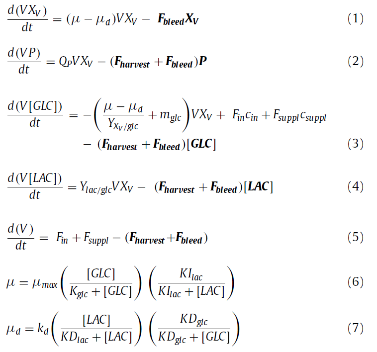

# CHO_reactor_modeling

Simulating reaction kinetics of CHO cells in a bioreactor using RNN.

Data is first generated from first principles using a Monod kinetic model. Kinetic model was taken from paper *"Computers and Chemical Engineering"* (2021), by Sara BADR.

The Kinetic model is as follows (excluding the Bleed, Haversting and Suppl terms since we are simulating a fed batch model):

